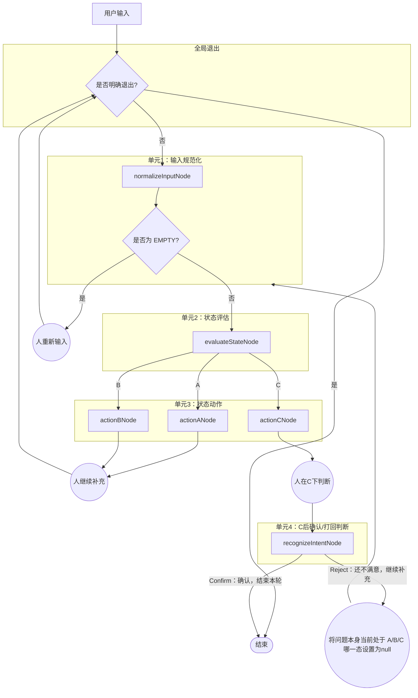

# TEMP


## 任务目标

实现  推进场景 最小可运行闭环的工作流。

## 背景

目前 我要做的是一个AI场景功能 （它是一个大系统中的一个核心的功能能模块） ，简单来说就是将一堆处理逻辑通过工作流编排成处理问题的工作流；比如 推进一个问题收敛到真正可以解决的程度 、从一堆迷雾似的需求中确定首先要解决什么问题、学习某个知识点。 将次要问题交给下一个运行的工作流 做处理，一个工作流只解决一个核心问题避免跑偏。
目前我们先解决 推进场景 这一个问题。

推进场景就是 我将自己如何思考问题的步骤抽象成的工作流。

工作流可以简单描述为这样。

1. 用户输入一个问题，如果判断后是没价值的输入那么就让其重新输入
2. 然后是对当前问题解决情况进行评估 我对问题解决情况分为了三种状态  [问题状态划分.md](问题状态划分.md)   **状态 A**：问题对象未稳定;**状态 B**：对象已稳定，但没有明确的可推进方向候选池未形成；**状态 C**：可推进方向候选池已形成，可选择
3. 状态不同执行不同的逻辑（每个状态不是一直定死的可能再用户提问沟通的过程中发现走偏了从当前的状态C又到了状态A）

> 状态 A、B、C 之后 都是对应的处理逻辑 他们都继承于 (AI对这个问题进行高质量的发散和高质量发散，把问题推进到更清晰、更可继续的状态 [问题分析.md](问题分析.md))但是又有自己特制的处理逻辑

1. 进入分支A  那么就是 用户继续补充 提问题然后进入步骤2  继续进行高质量问题分析 然后继续进行状态判断一直进行这样的循环 直到问题明确收敛到新的状态
2. 进入状态B 户继续补充 提问题然后进入步骤2 明确最核心的问题推动用户去明确以便抓住用户最核心的目标 然后继续进行状态判断一直进行这样的循环 以便进入状态C 让用户真正的能够解决问题
3. 状态C 目前的就是问题比较清晰了 也有了明确的可以向下一步推进的方向这是由两中情况
   1. 目前问题推进的已经清晰了人确定后本次工作流就结束了。
   2. 虽然目前AI判断流程已经很清晰了但是人的判断是还有问题 那么继续进行追问接着进行发散 状态判断等逻辑 一直执行预定的工作流直到 人确定后退出工作流
4. 人在任何时候都可以确定退出工作流 退出后 将本次工作流的原始输入输出交给其它的处理逻辑如总结 创建新分支  等等反正和工作流没有关系了。

- A 状态：问题对象未稳定
  问题没稳时，怎么澄清
- B 状态：对象已稳定，但没有明确的可推进方向候选池未形成
  问题已稳但候选未成时，怎么继续推进
- C 状态：可推进方向候选池已形成，可选择
  候选池已形成时，怎么把可选项摆出来

## 本次范围

* 实现 推进场景 的 6个具体的动作单元

  - 两个辅助的 动作单元

    1. normalizeInputNode
       作用是
       接住用户输入
       清洗 / 归一化
    2. recognizeIntentNode
       作用是：
       只在 状态 C 后判断，用户这句话到底是 Confirm 还是 Reject
  - 4个核心的 动作单元
    3. evaluateStateNode
    决定：
    现在处于 A / B / C 哪个状态
    接下来该调度哪个 Action
    4. actionANode
    作用是：
    执行状态A对应的动作逻辑
    问题没稳时，怎么澄清
    5. actionBNode
    作用是：
    执行状态B对应的动作逻辑
    6. actionCNode
    作用是：
    执行状态C对应的动作逻辑
    候选池已形成时，怎么把可选项摆出来
* 实现 推进场景 4个 逻辑单元

  1. 单元1：输入规范化
     对用户输入的问题进行规范化处理 例如 移除空格、换行符等
  2. 单元2：状态评估
     对当前问题解决情况进行评估 例如 问题对象是否稳定、是否有明确的可推进方向候选池等
  3. 单元3：状态动作
     根据当前状态执行不同的逻辑 例如 执行  状态A、状态B、状态C 对应的动作逻辑 等
  4. 单元4：C后确认/打回判断
     在状态C下判断用户是否确认或打回 例如 确认后结束本工作流并将本次所有的原始记录交给后续处理逻辑
* A / B / C 动作节点不再自己判断状态,它们只相信 evaluate 的结果.
* 工作流中的循环机制
* 实现用户输入 目前可以接收CLI输入纯文本。
* 实现 C 状态的岔路口：允许用户拒绝候选并退回 A/B 继续循环
* 实现 C 状态的确认机制：确认后结束本工作流并将本次所有的原始记录交给后续处理逻辑
* 三个状态间的流转没有任何强制的顺序
* 必须支持用户在任何时间任何节点只要明确表示要结束都能结束本工作流，并将本次所有的原始记录交给后续处理逻辑。
* 先做命令行可验证闭环
* 使用 LangGraph.js 实现工作流
* 使用 LangGraph.js  接入LLM模型
* 适配deepseek-reasoner 模型
* 全局的State
```typescript
interface AgentState {
  // LLM 上下文
  messages: BaseMessage[];

  // 本轮用户原始输入
  rawInput: string;

  // normalize 后的输入
  normalizedQuery: string;

  // evaluate 判出来的 A / B / C
  currentState: "A" | "B" | "C" | null;

  // 流程阶段，不等于问题状态
  // normal: 正常流转
  // await_c_intent: C 输出后，等用户 confirm / reject
  // ended: 已结束
  phase: "normal" | "await_c_intent" | "ended";

  // 是否强制退出
  shouldExit: boolean;

  // 最近一次 assistant 输出，给下一轮续上下文/交后续逻辑
  lastAssistantOutput: string;
}
```

## 非范围

* 不做 UI
* 不强制输出JSON

## 硬约束

* 必须基于 LangGraph.js
* 不允许把状态判断和动作输出混在一个提示词里

## 交付物

* 最小可运行代码骨架
* 6 个节点的状态定义与职责说明
* 条件边的路由逻辑（特别是 C 之后的二选一路由）
* 基本验证方式（必须包含“在 C 状态打回重评”的测试用例）

## 完成标志

* 用户可以正常输入，完成状态判断。
* 用户可以正常按照工作流执行推进，并到C退出。
* 必须能够支持用户强行退出，并且正常触发后续逻辑。
* 各种状态间的循环逻辑必须能够正常流转
* 必须有跑完每个节点的测试用例并且正常通过。
* A 和 B 路径可以任意多次循环
* **在 C 状态下，若用户表示不满意，系统能正确退回 A 或 B 继续循环**
* **在 C 状态下，若用户确认，正常结束工作流运行**
* 整个流程可在命令行环境下验证

## 已决定的设计约束

* 本工作流只负责问题推进，最终将工作流原始记录交给后续处理逻辑
* 尽量使用现有的开源工具来实现核心逻辑，编码只进行必要的逻辑粘合
